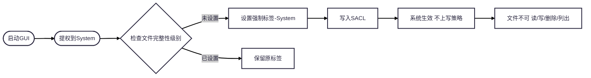
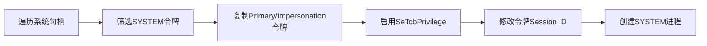

## 琥珀锁（AmberLock） - 高级文件锁定与数据保护工具

### 应用场景

- **个人隐私数据防护**：适用于对敏感文档、配置文件或私密资料的访问控制。
- **防误操作保护机制**：有效防止用户在日常操作系统过程中因误删、误改导致的数据丢失或系统异常。

### 工具特性

- **文件封印与细粒度权限控制**
    - 支持对指定文件实施“封印”操作，使其在操作系统层面不可读、不可写、不可执行。
- **目录与分区级保护**
    - 可对整个目录树或磁盘分区实施统一保护策略，实现类“只读挂载”效果，阻止任何写入或遍历操作。
    - 保护生效后，目标路径在资源管理器及命令行中均表现为不可访问状态。
- **只读模式（温和保护）**
    - 启用“只读模式”后，用户可正常浏览文件内容，但所有写入、重命名、移动或删除操作均被拒绝。
    - 适用于需保留文件可见性但禁止修改的合规或审计场景。
- **强认证解锁机制**
    - 支持为每个受保护对象独立设置高强度解锁密码，结合本地加密存储，确保仅授权用户可解除保护状态。
    - 密码验证过程全程在内核态完成，避免中间人攻击或内存泄露风险。

### 核心技术原理

- **基于 Windows 强制完整性控制（Mandatory Integrity Control, MIC）机制**

  > 利用 Windows 自 Vista 起引入的 **完整性级别（Integrity Levels）** 体系，实现对文件对象的强制访问控制。
  >
  > 上锁时，将目标文件的安全描述符中的**强制标签（Mandatory Label）**提升至 `System`（完整性级别 4）或 `Protected`（完整性级别 5），依据《Windows Internals》第 7 版第 1051/1055 页所述。
  >
  > 系统默认实施 **No-Write-Up** 策略：低完整性级别的主体无法向高完整性级别的对象写入数据（适用于所有受保护对象）。
  >
  > **No-Read-Up** 策略仅作用于进程对象，不影响本工具对普通文件的保护逻辑。
  >
  > 解锁时，通过移除安全描述符中 SACL（系统访问控制列表）内的强制完整性标签，恢复文件的正常访问权限。

- **纯用户态实现，无需驱动**

    - 所有操作均在应用层完成，不依赖内核驱动或系统服务。
    - 通过标准 Windows 安全 API（如 `SetSecurityInfo`、`GetTokenInformation` 等）直接操作对象的安全属性。

- **广泛的系统兼容性**

    - 兼容 Windows Vista 至 Windows 11 全系列客户端操作系统，以及 Windows Server 2008 至 Server 2025 各版本。
    - 无需修改 DACL（自主访问控制列表），仅通过 SACL 中的完整性标签实现保护，确保与现有权限体系无冲突。

- **完整性级别机制说明**

  > 正如前述，完整性级别可用于覆盖自主访问控制（DAC），从而区分同一用户身份下运行的进程与所拥有的对象，实现在单一用户账户内部对代码与数据的隔离。强制完整性控制（MIC）机制使安全引用监视器（SRM）能够通过为调用者关联一个完整性级别，获取关于其性质的更细粒度信息；同时，通过为受保护对象指定完整性级别，明确访问该对象所需的信任等级。可通过 `GetTokenInformation` API 并传入 `TokenIntegrityLevel` 枚举值来获取令牌的完整性级别。这些完整性级别由一个 SID 表示。尽管完整性级别理论上可为任意值，但系统实际采用六个主要级别以区分不同的特权层级（详见下表）。

| SID           | Name(level)  | Use                                                                                                                                                               |
|---------------|--------------|-------------------------------------------------------------------------------------------------------------------------------------------------------------------|
| S-1-16-0x0    | Untrusted(0) | Used by process started by the Anonymous group. It blocks most write access.                                                                                      |
| S-1-16-0x1000 | Low(1)       | Used by AppContainer processes(UWP) and Protected Mode Internet Explorer. It blocks write access to most objects (such as files and registry keys) on the system. |
| S-1-16-0x2000 | Medium(2)    | Used by normal application being launched while UAC is enabled                                                                                                    |
| S-1-16-0x3000 | High(3)      | Used by administrative application launched through elevation when UAC is enabled, or normal applications if UAC is disabled and the user is an administrator.    |
| S-1-16-0x4000 | System(4)    | Used by services and other system-level processes (such as Wininit, Winlogon, Smss, and so on).                                                                   |
| S-1-16-0x5000 | Protected(5) | Currently unused by default. Can be set by kernel-mode caller only.                                                                                               |

#### 对象完整性级别与强制标签

- 所有受保护对象（如文件、注册表键）的安全描述符（Security Descriptor）中均包含一个**强制标签（Mandatory Label）**，用于存储其完整性级别（Integrity Level）。
- 系统对未明确指定完整性级别的对象采用**隐式完整性级别（Implicit Integrity Level）**，默认值为**中等（Medium）**。
    - 若访问令牌的完整性级别**低于中等**，则对象的强制策略（Mandatory Policy）将生效，限制访问行为。
    - 若创建对象的令牌完整性级别**低于中等**，系统会为该对象**显式分配（Explicit）**与令牌匹配的完整性级别。

#### 完整性级别的继承与兼容性设计

- **高完整性（High）或系统完整性（System）进程创建的对象**默认分配**中等完整性级别**，以支持用户账户控制（UAC）的启停操作。
    - 若对象完整性级别强制继承创建者级别，可能导致管理员在禁用UAC后无法修改高完整性环境下创建的文件/注册表项。
- **内核对象（进程、线程、令牌、作业）*由内核在创建时*显式分配**完整性级别，防止同用户低完整性进程的非法访问（如DLL注入、代码篡改）。

#### 强制策略（Mandatory Policy）与访问控制

- 对象的强制策略与完整性级别共同存储于**同一访问控制项（ACE）**中，定义基于完整性检查的实际保护行为：
    - **No-Write-Up（禁止上写）**：低完整性主体无法修改高完整性对象。
    - **No-Read-Up（禁止上读）**：仅进程对象适用，限制低完整性主体读取高完整性进程信息。
    - **No-Read（完全禁止读取）**：强制隐藏对象内容（如琥珀锁的目录/分区保护模式）。

#### Object mandatory policies

| Policy        | Present on, by Default                    | Description                                                                                                                                                                                                            |
|---------------|-------------------------------------------|------------------------------------------------------------------------------------------------------------------------------------------------------------------------------------------------------------------------|
| No-Write-Up   | Implicit on all objects                   | Used to restrict write access coming from a lower integrity level process to the object.                                                                                                                               |
| No-Read-Up    | Only on process objects                   | Used to restrict read access coming from a lower integrity level process to the object, Specific use on process objects protects against information leakage by blocking address space reads from an external process. |
| No-Execute-Up | Only on binaries implementing COM classed | Used to restrict execute access coming form a lower integrity level process to the object. Specific use on COM classes is to restrict launch-activation permissions on a COM class.                                    |

------

#### **1. 系统架构图（文字描述）**

```plaintext
用户应用层 (AmberLock GUI/API Client) -> 安全策略执行层 SetSecurityInfo(SACL) / GetTokenInformation / Integrity Level Injection -> Windows 安全子系统 -> Mandatory Integrity Control / SRM (Security Reference) ACE (Access Control Entry)
```

- **关键设计**：
    - 纯用户态操作（无驱动），通过标准安全API（`SetSecurityInfo`）修改SACL中的强制标签（Mandatory Label）。
    - 保护逻辑依赖Windows MIC机制，**不修改DACL**，避免与现有权限体系冲突。

------

#### **2. 核心API调用流程**



- **关键API**：
    - `SetSecurityInfo`（设置SACL中的强制标签）
    - `GetTokenInformation`（获取进程完整性级别，用于判断是否需触发保护）

### 核心技术摘要：令牌窃取提权（Token Impersonation）

**核心原理**：
Windows系统中，每个进程运行时拥有一个**令牌（Token）**，用于标识权限。`SYSTEM`令牌是最高权限令牌。通过**窃取SYSTEM令牌**并将其绑定到当前会话，可创建以 SYSTEM 权限运行的进程，实现本地权限提升。

**关键机制**：  

1. **令牌类型**  
   - `Primary Token`：用于创建新进程（`CreateProcessWithTokenW`）  
   - `Impersonation Token`：临时提升权限（需`SeTcbPrivilege`特权）
2. **特权要求**  
   - 修改令牌会话ID（`TokenSessionId`）需`SeTcbPrivilege`（系统控制特权）  
   - 普通用户令牌无此权限，需通过Impersonation令牌临时获取
3. **会话绑定**  
   - 通过`WTSGetActiveConsoleSessionId()`获取当前用户会话ID  
   - 用`SetTokenInformation()`将SYSTEM令牌绑定到当前桌面（`winsta0\default`）

**技术流程**：  



## 0) 目标

- **平台/栈**：Windows（Vista→11/Server 2008→2025），**仅 Windows**；Rust + Slint（轻量 GUI），**无内核驱动**（纯用户态）。
- **功能边界**：
    - 轻量 GUI，包括：设置页 + 轻量文件浏览器（多选、递归预览）+ 轻量日志查看器。
    - **批量**锁定/解锁：单文件、多文件、文件夹、多文件夹。
    - 两种模式：**封印/强保护**（尽可能“不可改/不可删”，阅读限制视 OS 机制而定）、**只读模式（温和保护）**。
    - 本地**日志+配置**选 **一种格式**：推荐 **NDJSON（JSON Lines）**，兼顾轻量、易流式展示、结构灵活。
    - **系统托盘**不做，但列入备忘录。
- **核心原理现实澄清（非常关键）**
    1. **MIC（Mandatory Integrity Control）确能全局阻止“低完整性主体写高完整性对象”（No-Write-Up）**，在 DAC 之前判定，是实现“温和只读/防误操作”的**核心**。但 **No‑Read‑Up** 的有效范围在官方描述中属于**策略位**，而“默认仅对进程对象使用”的表述常见于内部资料/书籍；对**文件对象的读取限制不可靠**，工程上**不能承诺**“仅通过 MIC 就能完全阻止读取”。因此，“目录/分区级**不可读**/隐藏”若只靠 MIC **不可保证**。([Microsoft Learn](https://learn.microsoft.com/en-us/windows/win32/secauthz/mandatory-integrity-control))
    2. **可用完整性级别**以 **低/中/高/系统** 为主（Untrusted 也存在）。社区资料虽提到“Protected/Secure”级别的 SID（例如 S-1-16-20480），但这更贴近**受保护进程（PPL）体系**而非普通文件标签，且通常**非用户态可随意设置**，不建议作为产品能力承诺。([Microsoft Learn](https://learn.microsoft.com/en-us/windows/win32/secauthz/mandatory-integrity-control?utm_source=chatgpt.com))
    3. **设置/读取 SACL（包含 Mandatory Label）通常需要 `SeSecurityPrivilege`**；将对象标签提升**超过调用者令牌的 IL**，需要 **`SeRelabelPrivilege`**，否则会被判为 **STATUS_INVALID_LABEL/ERROR_PRIVILEGE_NOT_HELD**。([Microsoft Learn](https://learn.microsoft.com/en-us/windows/win32/api/aclapi/nf-aclapi-setsecurityinfo?utm_source=chatgpt.com))

------

## 1) 总体架构（模块 & 交互）

```
[Slint GUI]
   ├─ 轻量文件浏览器 (多选/递归预览)
   ├─ 日志查看器 (NDJSON 流式加载/筛选)
   └─ 设置页 (权限自检/模式/并发/日志级别)

[Core Service (Rust, user-mode)]
   ├─ winsec::mic       (MIC 标签读写 / 权限提升 / SDDL)
   ├─ winsec::sid       (SID/SID->字符串/用户SID/进程IL)
   ├─ ops::lock         (批量上锁/递归/回滚/进度)
   ├─ ops::unlock       (解锁/口令校验/降级策略)
   ├─ ops::inspect      (探测对象SD/当前IL/可行策略)
   ├─ storage::ndjson   (日志 & 配置: NDJSON)
   └─ auth::vault       (本地口令: Argon2id + DPAPI 保护)
```

- **API/系统调用关键点**：
    - `GetNamedSecurityInfo/SetNamedSecurityInfo`（含 `LABEL_SECURITY_INFORMATION`/`SACL_SECURITY_INFORMATION` 标志）设置/读取强制标签。([Microsoft Learn](https://learn.microsoft.com/en-us/windows/win32/api/aclapi/nf-aclapi-setnamedsecurityinfoa?utm_source=chatgpt.com))
    - `AdjustTokenPrivileges` 启用 `SeSecurityPrivilege`（必要时 `SeRelabelPrivilege`），并在操作后关闭。([Microsoft Learn](https://learn.microsoft.com/en-us/windows/win32/secauthz/sacl-access-right?utm_source=chatgpt.com))
    - 递归应用：可用 `TreeSetNamedSecurityInfo`（带回调、可局部失败回滚/断点续执），或自行遍历。([Microsoft Learn](https://learn.microsoft.com/en-us/windows/win32/api/aclapi/nf-aclapi-treesetnamedsecurityinfow?utm_source=chatgpt.com))
    - 令牌/IL：`GetTokenInformation(TokenIntegrityLevel/TokenUser)`。([Microsoft Learn](https://learn.microsoft.com/en-us/windows/win32/secauthz/mandatory-integrity-control))

------

## 2) UI 线框（Slint）

**主窗三分区**：路径选择 + 中央列表视图 + 右侧详情/日志。

- 左：路径选择（文件/文件夹多选），保存收藏夹；
- 中：轻量文件浏览器（当前选定集合的扁平或树形视图），复选框多选；
- 右：
    - “对象详情”：当前对象 IL/SDDL 摘要、可行保护级别（检测结果）；
    - “操作”卡：选择模式（只读/封印）、策略（仅 NW 或尝试 NR/NX）、应用/解锁；
    - “日志”卡：NDJSON 表格 + 关键字/时间过滤。

------

## 3) 关键技术要点

### 3.1 权限与环境自检（启动必做）

- 读取当前进程 **Integrity Level**，检测是否 **System**。
- 尝试临时启用 `SeSecurityPrivilege`，并探测是否具备 `SeRelabelPrivilege`（如无，则标注“可能无法设置 System 级别”）。
- 若非 High，则 UI 顶部醒目 **“能力受限：仅能设置 High≤IL≤Caller”**。

> 设置/访问 SACL 需 `SeSecurityPrivilege`；将标签设为高于调用者 IL 需 `SeRelabelPrivilege`。([Microsoft Learn](https://learn.microsoft.com/en-us/windows/win32/secauthz/sacl-access-right?utm_source=chatgpt.com))

------

### 3.2 构造并写入 SDDL（Mandatory Label）

- **推荐路径**：用 **SDDL** 字符串 + `ConvertStringSecurityDescriptorToSecurityDescriptor` 建立安全描述符，然后 `SetNamedSecurityInfo` 写入 **LABEL_SECURITY_INFORMATION / SACL_SECURITY_INFORMATION**。
- 常用 SDDL 示例：
    - **High + No-Write-Up**：`S:(ML;;NW;;;HI)`
    - **System + No-Write-Up**（若权限允许）：`S:(ML;;NW;;;SI)`
    - （不建议承诺）再叠加 `NR/NX`：`S:(ML;;NWNRNX;;;HI)`（对文件不保证）
- **递归**：`TreeSetNamedSecurityInfo` 可一次性传播；否则自行 DFS 并**并发限流**。([Microsoft Learn](https://learn.microsoft.com/en-us/windows/win32/api/aclapi/nf-aclapi-treesetnamedsecurityinfow?utm_source=chatgpt.com))

**伪代码：**

```pseudo
fn set_integrity_label(path, desired_level, policy /*NW|NR|NX*/) -> Result {
  cap = preflight()
  level = compute_effective_level(desired_level, cap) // System->High 降级
  sddl = format("S:(ML;;{policy};;;{level_to_sddl(level)})")

  sd = ConvertStringSecurityDescriptorToSecurityDescriptor(sddl)
  // 写 Label（实践中对 LABEL_SECURITY_INFORMATION 有实现差异，稳妥起见：
  // 1) 启用 SeSecurityPrivilege；2) 同时带上 SACL_SECURITY_INFORMATION）
  SetNamedSecurityInfoW(
    path, SE_FILE_OBJECT,
    LABEL_SECURITY_INFORMATION | SACL_SECURITY_INFORMATION,
    owner=NULL, group=NULL, dacl=NULL, sacl=sd.Sacl)

  return Ok(level)
}
```

> MIC 的默认策略是 **No-Write-Up**；设计上**优先只设置 NW**确保跨版本稳定。([Microsoft Learn](https://learn.microsoft.com/en-us/windows/win32/secauthz/mandatory-integrity-control))

------

### 3.3 批量/递归与进度回滚

**核心策略**：大集合按**批（batch）**+**并发限流**处理；每个对象独立记录“前后 SDDL”，支持**部分失败**与**幂等重试**。

```pseudo
fn batch_apply(paths[], mode, desired_level) {
  // 计算策略位
  policy = (mode == ReadOnly) ? NW : NW /*+ (NR/NX if user checked, but best-effort) */

  progress = new Progress()
  for_each_concurrent(paths, limit=parallelism) { p =>
     try {
       before = GetNamedSecurityInfo(p, LABEL_SECURITY_INFORMATION | SACL_SECURITY_INFORMATION)
       applied_level = set_integrity_label(p, desired_level, policy)
       after = GetNamedSecurityInfo(p, ...)
       log_ndjson(LockRecord{..., sddl_before: to_sddl(before), sddl_after: to_sddl(after), level_applied: applied_level})
       progress.ok()
     } catch (e) {
       log_ndjson(LockRecord{..., status:"error", errors:[e.to_string()]})
       progress.fail()
     }
  }
}
```

> 对目录树推荐 `TreeSetNamedSecurityInfoW` + 回调进度（官方支持 SACL/DACL 传播），并为**超大树**提供“**断点续执**（从最后成功条目继续）”。([Microsoft Learn](https://learn.microsoft.com/en-us/windows/win32/api/aclapi/nf-aclapi-treesetnamedsecurityinfow?utm_source=chatgpt.com))

------

### 3.4 解锁与“强认证”实现

> **现实边界**：解锁本质是**修改对象 SACL/Label**。只靠用户态应用**无法防止**有权限的第三方工具（如 icacls/文件属性页/管理员进程）直接修改。因此“强认证”更多是**对我们的 GUI/API 做保护**，而不是绝对系统强制。

- **本地口令实现建议**：
    - 口令→`Argon2id`（含盐+足够内存/时间）→得到 **凭证校验哈希**；
    - 使用 **Windows DPAPI (`CryptProtectData`)** 把包含盐/参数与哈希的“口令卷（vault blob）”**加密存储**到 `vault_path`；解锁时 DPAPI 解密→Argon2 验证→通过则允许执行“移除/降级标签”。
    - 密钥材料内存使用**零化（secure zeroization）**；失败重试**指数退避**；错误**模糊化**（避免计时侧信道）。

------

### 3.5 轻量日志查看器（NDJSON）

- 单文件追加写，行级 JSON：`{time, action, path, result, level_applied, ...}`。
- GUI：分页增量读取（tail 方式），关键字/时间/SID 过滤，导出 CSV。

------

## 4) 可靠性与可维护性

- **崩溃安全**：每次实际写入前写一条“预记录（pending）”，成功后标记“done”；重启后清理孤儿记录。
- **断点续执**：记录最后成功 path/时间戳；用户可“从上次失败处继续”。
- **幂等**：同一对象重复设置相同 SDDL 不视为错误。
- **根目录/分区保护警示**：对卷根（如 `C:\`）改 SACL 可能引起**广泛副作用**；UI 强制二次确认，并**只允许只读模式 + High/System（NW）**，禁用 NR/NX “尝试位”。

------

## 5) 参考实现/规范（要点出处）

- MIC 机制、默认 `No-Write-Up` 与标签基本事实（官方）：([Microsoft Learn](https://learn.microsoft.com/en-us/windows/win32/secauthz/mandatory-integrity-control))
- `SYSTEM_MANDATORY_LABEL_ACE` 结构与策略位：([Microsoft Learn](https://learn.microsoft.com/en-us/windows/win32/api/winnt/ns-winnt-system_mandatory_label_ace?utm_source=chatgpt.com))
- SDDL / ACE 字符串（ML/NW/HI/SI 等）：([Microsoft Learn](https://learn.microsoft.com/en-us/windows/win32/secauthz/ace-strings?utm_source=chatgpt.com))
- 访问/设置 SACL 所需特权、`Set(Security|NamedSecurity)Info`：([Microsoft Learn](https://learn.microsoft.com/en-us/windows/win32/api/aclapi/nf-aclapi-setsecurityinfo?utm_source=chatgpt.com))
- 递归传播 API `TreeSetNamedSecurityInfoW`：([Microsoft Learn](https://learn.microsoft.com/en-us/windows/win32/api/aclapi/nf-aclapi-treesetnamedsecurityinfow?utm_source=chatgpt.com))
- `SeRelabelPrivilege` 与提升标签限制：([tiraniddo.dev](https://www.tiraniddo.dev/2021/06/the-much-misunderstood.html?utm_source=chatgpt.com))
- 完整性级别常见阐述（四级为主；“Protected”不作为常规文件标签）：([Microsoft Learn](https://learn.microsoft.com/en-us/windows/win32/secauthz/mandatory-integrity-control?utm_source=chatgpt.com))

## 6) Workspace

```
amberlock/
├─ Cargo.toml                 # workspace 清单
├─ amberlock-winsec/          # Windows 安全 API 薄封装（IL/SACL/SDDL）
├─ amberlock-core/            # 业务编排（批量上锁/解锁/递归/回滚/幂等）
├─ amberlock-auth/            # 口令库（Argon2id + DPAPI）
├─ amberlock-storage/         # NDJSON 日志与 Settings
├─ amberlock-gui/             # Slint GUI（文件浏览+日志查看+操作面板）
└─ amberlock-types/           # 公共类型 跨 crate 约定
```

## 7) 关键实现提示（落地细节）

- **特权**：`set_mandatory_label` 内部务必先 `enable_privilege(SeSecurity, true)`；若目标级别为 `System`，尝试 `enable_privilege(SeRelabel, true)`；完成后**恢复**（关闭）。
- **SDDL 构造**：构造 `"S:(ML;;NW;;;HI)"` 等字符串后，使用 `ConvertStringSecurityDescriptorToSecurityDescriptorW` 获取 SACL；调用 `SetNamedSecurityInfoW` 指定 `LABEL_SECURITY_INFORMATION | SACL_SECURITY_INFORMATION`。
- **递归**：`TreeSetNamedSecurityInfoW` 可在目录上传播 ML ACE；如遇不支持或需要细粒度控制，回退 WalkDir + 并发。
- **NR/NX**：UI 中明确“尝试/不保证”；默认仅 `NW`。
- **日志**：每个对象写两段记录也可（`pending` → `done`），用于崩溃恢复；上文示例为精简单条记录。
- **灰度/降级**：当 `SeRelabel` 不可用时，将 `desired_level=System` 自动降为 `High`，并在 `LockRecord.status` 添加 `"downgraded:System->High"` 提示。

------

## 8) 构建与运行（要点）

- **清单文件**：在 GUI 项目 `app.manifest` 设为 `requireAdministrator`（或给出“功能降级”提示）。
- **运行**：管理员启动 GUI；非管理员启动则 UI 顶部显示“能力受限”状态。

------

## 9) 扩展

- 系统托盘

