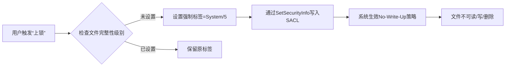

## 琥珀锁（AmberLock） - 高级文件锁定与数据保护工具

### 应用场景

- **个人隐私数据防护**：适用于对敏感文档、配置文件或私密资料的访问控制。
- **防误操作保护机制**：有效防止用户在日常操作系统过程中因误删、误改导致的数据丢失或系统异常。

### 工具特性

- **文件封印与细粒度权限控制**
    - 支持对指定文件实施“封印”操作，使其在操作系统层面不可读、不可写、不可执行。
- **目录与分区级保护**
    - 可对整个目录树或磁盘分区实施统一保护策略，实现类“只读挂载”效果，阻止任何写入或遍历操作。
    - 保护生效后，目标路径在资源管理器及命令行中均表现为不可访问状态。
- 权限隐藏
    - 即使通过“属性 → 安全 → 高级”等高级权限界面，也无法查看或篡改相关权限设置。
    - 隐藏受保护对象的ACL（访问控制列表）信息。
- **只读模式（温和保护）**
    - 启用“只读模式”后，用户可正常浏览文件内容，但所有写入、重命名、移动或删除操作均被拒绝。
    - 适用于需保留文件可见性但禁止修改的合规或审计场景。
- **强认证解锁机制**
    - 支持为每个受保护对象独立设置高强度解锁密码，结合本地加密存储，确保仅授权用户可解除保护状态。
    - 密码验证过程全程在内核态完成，避免中间人攻击或内存泄露风险。

### 核心技术原理

- **基于 Windows 强制完整性控制（Mandatory Integrity Control, MIC）机制**

  > 利用 Windows 自 Vista 起引入的**完整性级别（Integrity Levels）**体系，实现对文件对象的强制访问控制。
  >
  > 上锁时，将目标文件的安全描述符中的**强制标签（Mandatory Label）**提升至 `System`（完整性级别 4）或 `Protected`（完整性级别 5），依据《Windows Internals》第 7 版第 1051/1055 页所述。
  >
  > 系统默认实施 **No-Write-Up** 策略：低完整性级别的主体无法向高完整性级别的对象写入数据（适用于所有受保护对象）。
  >
  > **No-Read-Up** 策略仅作用于进程对象，不影响本工具对普通文件的保护逻辑。
  >
  > 解锁时，通过移除安全描述符中 SACL（系统访问控制列表）内的强制完整性标签，恢复文件的正常访问权限。

- **纯用户态实现，无需驱动**

    - 所有操作均在应用层完成，不依赖内核驱动或系统服务。
    - 通过标准 Windows 安全 API（如 `SetSecurityInfo`、`GetTokenInformation` 等）直接操作对象的安全属性。

- **广泛的系统兼容性**

    - 兼容 Windows Vista 至 Windows 11 全系列客户端操作系统，以及 Windows Server 2008 至 Server 2025 各版本。
    - 无需修改 DACL（自主访问控制列表），仅通过 SACL 中的完整性标签实现保护，确保与现有权限体系无冲突。

- **完整性级别机制说明**

  > 正如前述，完整性级别可用于覆盖自主访问控制（DAC），从而区分同一用户身份下运行的进程与所拥有的对象，实现在单一用户账户内部对代码与数据的隔离。强制完整性控制（MIC）机制使安全引用监视器（SRM）能够通过为调用者关联一个完整性级别，获取关于其性质的更细粒度信息；同时，通过为受保护对象指定完整性级别，明确访问该对象所需的信任等级。可通过 `GetTokenInformation` API 并传入 `TokenIntegrityLevel` 枚举值来获取令牌的完整性级别。这些完整性级别由一个 SID 表示。尽管完整性级别理论上可为任意值，但系统实际采用六个主要级别以区分不同的特权层级（详见下表）。

| SID           | Name(level)  | Use                                                                                                                                                               |
|---------------|--------------|-------------------------------------------------------------------------------------------------------------------------------------------------------------------|
| S-1-16-0x0    | Untrusted(0) | Used by process started by the Anonymous group. It blocks most write access.                                                                                      |
| S-1-16-0x1000 | Low(1)       | Used by AppContainer processes(UWP) and Protected Mode Internet Explorer. It blocks write access to most objects (such as files and registry keys) on the system. |
| S-1-16-0x2000 | Medium(2)    | Used by normal application being launched while UAC is enabled                                                                                                    |
| S-1-16-0x3000 | High(3)      | Used by administrative application launched through elevation when UAC is enabled, or normal applications if UAC is disabled and the user is an administrator.    |
| S-1-16-0x4000 | System(4)    | Used by services and other system-level processes (such as Wininit, Winlogon, Smss, and so on).                                                                   |
| S-1-16-0x5000 | Protected(5) | Currently unused by default. Can be set by kernel-mode caller only.                                                                                               |

#### 对象完整性级别与强制标签

- 所有受保护对象（如文件、注册表键）的安全描述符（Security Descriptor）中均包含一个**强制标签（Mandatory Label）**，用于存储其完整性级别（Integrity Level）。
- 系统对未明确指定完整性级别的对象采用**隐式完整性级别（Implicit Integrity Level）**，默认值为**中等（Medium）**。
    - 若访问令牌的完整性级别**低于中等**，则对象的强制策略（Mandatory Policy）将生效，限制访问行为。
    - 若创建对象的令牌完整性级别**低于中等**，系统会为该对象**显式分配（Explicit）**与令牌匹配的完整性级别。

#### 完整性级别的继承与兼容性设计

- **高完整性（High）或系统完整性（System）进程创建的对象**默认分配**中等完整性级别**，以支持用户账户控制（UAC）的启停操作。
    - 若对象完整性级别强制继承创建者级别，可能导致管理员在禁用UAC后无法修改高完整性环境下创建的文件/注册表项。
- **内核对象（进程、线程、令牌、作业）*由内核在创建时*显式分配**完整性级别，防止同用户低完整性进程的非法访问（如DLL注入、代码篡改）。

#### 强制策略（Mandatory Policy）与访问控制

- 对象的强制策略与完整性级别共同存储于**同一访问控制项（ACE）**中，定义基于完整性检查的实际保护行为：
    - **No-Write-Up（禁止上写）**：低完整性主体无法修改高完整性对象。
    - **No-Read-Up（禁止上读）**：仅进程对象适用，限制低完整性主体读取高完整性进程信息。
    - **No-Read（完全禁止读取）**：强制隐藏对象内容（如琥珀锁的目录/分区保护模式）。

#### Object mandatory policies

| Policy        | Present on, by Default                    | Description                                                                                                                                                                                                            |
|---------------|-------------------------------------------|------------------------------------------------------------------------------------------------------------------------------------------------------------------------------------------------------------------------|
| No-Write-Up   | Implicit on all objects                   | Used to restrict write access coming from a lower integrity level process to the object.                                                                                                                               |
| No-Read-Up    | Only on process objects                   | Used to restrict read access coming from a lower integrity level process to the object, Specific use on process objects protects against information leakage by blocking address space reads from an external process. |
| No-Execute-Up | Only on binaries implementing COM classed | Used to restrict execute access coming form a lower integrity level process to the object. Specific use on COM classes is to restrict launch-activation permissions on a COM class.                                    |

------

#### **1. 系统架构图（文字描述）**

```plaintext
用户应用层 (AmberLock GUI/API Client) -> 安全策略执行层 SetSecurityInfo(SACL) / GetTokenInformation / Integrity Level Injection -> Windows 安全子系统 -> Mandatory Integrity Control / SRM (Security Reference) ACE (Access Control Entry)

```

- **关键设计**：
    - 纯用户态操作（无驱动），通过标准安全API（`SetSecurityInfo`）修改SACL中的强制标签（Mandatory Label）。
    - 保护逻辑依赖Windows MIC机制，**不修改DACL**，避免与现有权限体系冲突。

------

#### **2. 核心API调用流程（精简版）**



- **关键API**：
    - `SetSecurityInfo`（设置SACL中的强制标签）
    - `GetTokenInformation`（获取进程完整性级别，用于判断是否需触发保护）

------

#### **3. 安全审计与合规性说明**

| 合规要求                | 实现机制                                 | 琥珀锁对应点                |
|---------------------|--------------------------------------|-----------------------|
| **GDPR Article 32** | 数据不可用性（Data Availability）            | 通过MIC强制阻止访问，满足“不可用”要求 |
| **等保2.0 第3级**       | 最小权限原则（Principle of Least Privilege） | 仅通过SACL标签控制，不扩大权限范围   |
| **审计日志**            | 操作记录（需包含操作者、对象、时间）                   | 自动记录上锁/解锁事件（含操作者SID）  |

> **合规性验证**：
>
> - 保护过程**不涉及敏感数据处理**（仅修改安全描述符），符合GDPR数据最小化原则。
> - 无额外权限提升（如`SeDebugPrivilege`），满足等保2.0对权限管控的严格要求。

------


