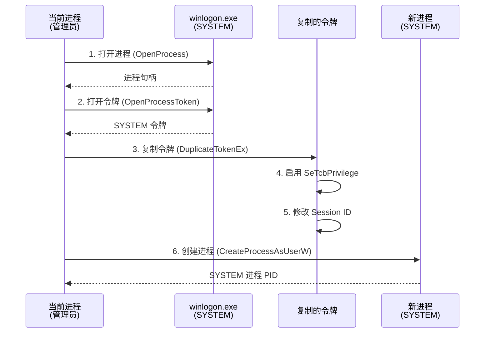

# AmberLock 令牌窃取提权模块使用指南

## ⚠️ 安全警告

此功能为**高风险操作**，仅限以下合法场景使用：
- 系统管理和维护
- 安全研究和测试
- 企业级权限管理工具

**严禁用于非法目的！使用前请确保：**
1. 拥有系统的合法管理权限
2. 在受控的测试环境中运行
3. 已告知并获得系统所有者授权

## 技术原理

### 令牌窃取流程



### 关键步骤

1. **定位 SYSTEM 进程**
   - 优先级：`winlogon.exe` > `services.exe` > `lsass.exe`
   - 使用 `CreateToolhelp32Snapshot` 遍历进程

2. **复制主令牌**
   - 类型：`TokenPrimary`（用于创建进程）
   - 权限：`TOKEN_ALL_ACCESS`

3. **启用特权**
   - `SeTcbPrivilege`：修改会话ID必需
   - 使用 `AdjustTokenPrivileges`

4. **修改会话ID**
   - 获取当前用户会话：`WTSGetActiveConsoleSessionId()`
   - 绑定到桌面：`winsta0\default`

5. **创建进程**
   - API：`CreateProcessAsUserW`
   - 标志：`CREATE_NEW_CONSOLE | CREATE_UNICODE_ENVIRONMENT`

## 使用示例

### 1. 快速创建 SYSTEM 进程

```rust
use amberlock_winsec::spawn_system_process;

fn main() -> anyhow::Result<()> {
    // 以 SYSTEM 权限启动命令提示符
    let pid = spawn_system_process("cmd.exe")?;
    println!("✅ 已创建 SYSTEM 进程: PID={}", pid);
    
    // 或启动自定义程序
    let pid = spawn_system_process(r"C:\Tools\MyTool.exe --admin-mode")?;
    println!("✅ MyTool 正在以 SYSTEM 权限运行: PID={}", pid);
    
    Ok(())
}
```

### 2. 临时提权执行操作

```rust
use amberlock_winsec::with_system_privileges;

fn main() -> anyhow::Result<()> {
    // 在闭包内，当前线程临时拥有 SYSTEM 权限
    with_system_privileges(|| {
        // 修改系统级文件
        std::fs::write(r"C:\Windows\System32\config\test.txt", b"SYSTEM")?;
        
        // 访问受保护的注册表项
        // ...
        
        Ok(())
    })?; // 自动恢复原始权限
    
    println!("✅ 操作完成，已恢复普通权限");
    Ok(())
}
```

### 3. 高级用法：手动控制上下文

```rust
use amberlock_winsec::ImpersonationContext;

fn main() -> anyhow::Result<()> {
    // 创建令牌窃取上下文
    let ctx = ImpersonationContext::from_system_process()?;
    
    // 方式1：创建新进程
    let pid = ctx.create_process("powershell.exe", false)?;
    println!("PowerShell 进程: PID={}", pid);
    
    // 方式2：模拟令牌
    ctx.impersonate()?;
    
    // 执行需要 SYSTEM 权限的操作
    // ...
    
    // 恢复原始权限
    ImpersonationContext::revert_to_self()?;
    
    Ok(())
}
```

## 集成到 AmberLock

### 场景1：强制解锁 System 级文件

```rust
use amberlock_core::batch_unlock;
use amberlock_winsec::with_system_privileges;

pub fn force_unlock_system_files(
    paths: &[PathBuf],
    password: &str,
) -> Result<BatchResult> {
    with_system_privileges(|| {
        // 在 SYSTEM 权限下执行解锁
        let vault_blob = std::fs::read("vault.bin")?;
        let logger = NdjsonWriter::open_append("logs/operations.ndjson")?;
        
        batch_unlock(paths, password, &vault_blob, &logger, None)
    })
}
```

### 场景2：修复权限损坏的文件

```rust
use amberlock_winsec::{spawn_system_process, set_mandatory_label};

pub fn repair_file_permissions(path: &str) -> Result<()> {
    // 启动 SYSTEM 权限的修复进程
    let cmd = format!(
        r#"cmd.exe /c takeown /f "{}" && icacls "{}" /reset"#,
        path, path
    );
    
    let pid = spawn_system_process(&cmd)?;
    
    // 等待修复完成后，设置正确的 MIC 标签
    set_mandatory_label(path, LabelLevel::High, MandPolicy::NW)?;
    
    Ok(())
}
```

### 场景3：GUI 集成示例

在 `amberlock-gui/src/bridge.rs` 中添加：

```rust
/// 请求 SYSTEM 权限执行操作
pub fn execute_with_system_privileges<F, R>(operation: F) -> Result<R>
where
    F: FnOnce() -> Result<R> + Send + 'static,
    R: Send + 'static,
{
    use amberlock_winsec::with_system_privileges;
    
    // 显示警告对话框
    let confirmed = dialogs::show_warning_dialog(
        "权限提升",
        "此操作需要 SYSTEM 权限，将临时提升进程权限。\n\n是否继续？",
    );
    
    if !confirmed {
        anyhow::bail!("用户取消操作");
    }
    
    // 在 SYSTEM 权限下执行
    with_system_privileges(operation)
}
```

然后在 `main.rs` 中使用：

```rust
setup_force_unlock_handler(&app, settings, logger, file_model);

fn setup_force_unlock_handler(...) {
    app.on_force_unlock(move || {
        let paths = FileListModel::selected_paths_static();
        
        match execute_with_system_privileges(|| {
            // 这里的代码以 SYSTEM 权限运行
            batch_unlock(&paths, "password", &vault_blob, &logger, None)
        }) {
            Ok(result) => {
                app.set_status_text(
                    format!("✅ 强制解锁成功: {}/{}", result.succeeded, result.total).into()
                );
            }
            Err(e) => {
                app.set_status_text(format!("❌ 强制解锁失败: {:?}", e).into());
            }
        }
    });
}
```

## 错误处理

### 常见错误及解决方案

| 错误 | 原因 | 解决方案 |
|------|------|----------|
| `OpenProcess 失败` | 未以管理员运行 | 右键 → "以管理员身份运行" |
| `未找到进程: winlogon.exe` | 系统进程被隐藏 | 检查安全软件设置 |
| `AdjustTokenPrivileges 失败` | 缺少 SeTcbPrivilege | 以 SYSTEM 权限启动父进程 |
| `SetTokenInformation 失败` | 目标会话ID无效 | 确保用户已登录 |

### 错误处理示例

```rust
match spawn_system_process("cmd.exe") {
    Ok(pid) => {
        println!("✅ 成功: PID={}", pid);
    }
    Err(WinSecError::Win32 { code, msg }) => {
        eprintln!("❌ Windows API 错误 0x{:08X}: {}", code, msg);
        
        // 根据错误码提供解决方案
        match code {
            0x00000005 => eprintln!("💡 解决方案：以管理员身份运行"),
            0x00000057 => eprintln!("💡 解决方案：检查进程名是否正确"),
            _ => eprintln!("💡 解决方案：查阅 Windows 错误代码文档"),
        }
    }
    Err(e) => {
        eprintln!("❌ 未知错误: {:?}", e);
    }
}
```

## 安全最佳实践

### 1. 最小权限原则

```rust
// ❌ 不推荐：始终以 SYSTEM 运行
let ctx = ImpersonationContext::from_system_process()?;
ctx.impersonate()?;
// 整个程序都在 SYSTEM 权限下运行

// ✅ 推荐：仅在必要时提权
fn do_normal_work() {
    // 普通权限操作
}

fn do_privileged_work() {
    with_system_privileges(|| {
        // 仅此处以 SYSTEM 权限运行
        Ok(())
    }).unwrap();
}
```

### 2. 审计日志

```rust
use amberlock_storage::NdjsonWriter;

fn audit_privileged_operation(operation: &str, result: &str) {
    let logger = NdjsonWriter::open_append("audit.log").unwrap();
    
    let record = serde_json::json!({
        "time": chrono::Utc::now().to_rfc3339(),
        "operation": operation,
        "result": result,
        "user_sid": amberlock_winsec::read_user_sid().unwrap_or_default(),
    });
    
    logger.write_record(&record).ok();
}

// 使用
with_system_privileges(|| {
    audit_privileged_operation("force_unlock", "started");
    
    // 执行操作
    let result = batch_unlock(...)?;
    
    audit_privileged_operation("force_unlock", "success");
    Ok(result)
})?;
```

### 3. 用户确认

```rust
// 在执行敏感操作前，始终要求用户确认
fn require_user_confirmation(message: &str) -> bool {
    dialogs::show_warning_dialog("安全确认", message)
}

if require_user_confirmation("即将以 SYSTEM 权限修改系统文件，是否继续？") {
    with_system_privileges(|| {
        // 执行操作
        Ok(())
    })?;
}
```

## 性能优化

### 1. 复用令牌上下文

```rust
// ❌ 不推荐：每次都创建新上下文
for file in files {
    let ctx = ImpersonationContext::from_system_process()?; // 开销大
    ctx.create_process(&format!("process.exe {}", file), false)?;
}

// ✅ 推荐：复用上下文
let ctx = ImpersonationContext::from_system_process()?;
for file in files {
    ctx.create_process(&format!("process.exe {}", file), false)?;
}
```

### 2. 批量操作

```rust
// ✅ 推荐：在一次提权中完成所有操作
with_system_privileges(|| {
    for file in files {
        set_mandatory_label(file, LevelLevel::System, MandPolicy::NW)?;
    }
    Ok(())
})?;
```

## 测试

### 单元测试

```rust
#[cfg(test)]
mod tests {
    use super::*;

    #[test]
    #[cfg_attr(not(target_os = "windows"), ignore)]
    fn test_impersonation_creates_valid_context() {
        // 需要管理员权限
        if let Ok(ctx) = ImpersonationContext::from_system_process() {
            assert!(ctx.session_id > 0);
        }
    }

    #[test]
    #[ignore] // 需要手动测试
    fn test_spawn_notepad() {
        let pid = spawn_system_process("notepad.exe").unwrap();
        assert!(pid > 0);
        
        // 手动验证：任务管理器中 notepad.exe 的用户应为 SYSTEM
    }
}
```

### 集成测试

在 `amberlock-winsec/tests/` 创建 `integration_impersonate.rs`：

```rust
#[test]
#[cfg_attr(not(target_os = "windows"), ignore)]
fn test_full_privilege_escalation_workflow() {
    use amberlock_winsec::{spawn_system_process, with_system_privileges};
    use std::fs;

    // 1. 创建 SYSTEM 进程
    let pid = spawn_system_process("cmd.exe /c echo test").unwrap();
    assert!(pid > 0);

    // 2. 临时提权执行操作
    with_system_privileges(|| {
        let test_file = r"C:\Windows\Temp\amberlock_test.txt";
        fs::write(test_file, b"SYSTEM test")?;
        
        let content = fs::read_to_string(test_file)?;
        assert_eq!(content, "SYSTEM test");
        
        fs::remove_file(test_file)?;
        Ok(())
    }).unwrap();
}
```

## 故障排查

### 日志记录

启用详细日志：

```rust
env_logger::Builder::new()
    .filter_level(log::LevelFilter::Debug)
    .init();

// 在关键步骤记录日志
log::info!("正在查找 SYSTEM 进程...");
log::debug!("尝试打开进程: {}", process_name);
```

### 调试技巧

1. **检查当前权限**：
   ```rust
   let il = amberlock_winsec::read_process_il()?;
   println!("当前进程完整性级别: {:?}", il);
   ```

2. **验证令牌有效性**：
   ```rust
   use windows::Win32::Security::GetTokenInformation;
   // 查询令牌信息验证
   ```

3. **进程监控**：
   - 使用 Process Explorer 查看进程令牌
   - 使用 Process Monitor 跟踪 API 调用

## 法律声明

本模块遵循以下原则：
1. **合法使用**：仅用于授权的系统管理和安全研究
2. **责任限制**：开发者不对滥用行为负责
3. **透明性**：所有操作可审计和记录
4. **可撤销性**：提供恢复原始权限的机制

**使用本模块即表示您同意承担所有法律责任。**

---

*最后更新：2025-12-08*  
*版本：2.0.0*  
*作者：AmberLock Security Team*